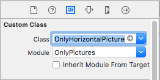

<p align="center">
   
  &nbsp;&nbsp;&nbsp;&nbsp;&nbsp;&nbsp;&nbsp;&nbsp;&nbsp;&nbsp;&nbsp;&nbsp;
   
  &nbsp;&nbsp;&nbsp;&nbsp;&nbsp;&nbsp;&nbsp;&nbsp;&nbsp;&nbsp;&nbsp;&nbsp;
  
</p>

<p align="center">
   
  &nbsp;&nbsp;&nbsp;&nbsp;&nbsp;&nbsp;&nbsp;&nbsp;&nbsp;&nbsp;&nbsp;&nbsp;
   
  &nbsp;&nbsp;&nbsp;&nbsp;&nbsp;&nbsp;&nbsp;&nbsp;&nbsp;&nbsp;&nbsp;&nbsp;
  
</p>


<p align="center">
    <a href="https://twitter.com/Kiranjasvanee">
        
    </a>
    <a href="https://github.com/KiranJasvanee/OnlyPictures/blob/master/LICENSE">
        
    </a>
    <a href="https://cocoapods.org/pods/OnlyPictures">
        
    </a>
    <a href="http://cocoapods.org/pods/OnlyPictures/">
        
    </a>
    <a href="https://github.com/KiranJasvanee/OnlyPictures/issues">
        
    </a>
    <a href="https://github.com/KiranJasvanee/OnlyPictures">
        
    </a>
    <a href="https://github.com/KiranJasvanee/OnlyPictures">
        
    </a>
    <a href="https://github.com/KiranJasvanee/OnlyPictures">
        
    </a>
</p>

----------------

### Installation

OnlyPictures is available through [CocoaPods](http://cocoapods.org). To install
it, simply add the following line to your Podfile:

```ruby
pod 'OnlyPictures'
```

### Usage

Add `UIView` in your outlet, select it and go to `Properties -> Identity Inspector`,  add `OnlyHorizontalPictures` in `class property`. `OnlyVerticalPictures` about to release soon.

 &nbsp;&nbsp;&nbsp;&nbsp; `->` &nbsp;&nbsp;&nbsp;&nbsp;  

Create `instance` of this outlet as below.
```
@IBOutlet weak var onlyPictures: OnlyHorizontalPictures!
```

Use `DataSource` for data assignment & `Delegate` to get indication of action performed in pictures.
```
onlyPictures.dataSource = self
onlyPictures.delegate = self
```

#### DataSource Methods

```
extension ViewController: OnlyPicturesDataSource {

    // ---------------------------------------------------
    // returns the total no of pictures
    
    func numberOfPictures() -> Int {
        return pictures.count
    }
    
    // ---------------------------------------------------
    // returns the no of pictures should be visible in screen. 
    // In above preview, Left & Right formats are example of visible pictures, if you want pictures to be shown without count, remove this function, it's optional.
    
    func visiblePictures() -> Int {
        return 6
    }
    
    // ---------------------------------------------------
    // return the images you want to show.
    
    func pictureViews(index: Int) -> UIImage {
        return pictures[index]
    }
}
```
#### Delegate Methods
```
extension ViewController: OnlyPicturesDelegate {
    
    // ---------------------------------------------------
    // receive an action of selected picture tap index
    
    func pictureView(_ imageView: UIImageView, didSelectAt index: Int) {
        
    }
    
    // ---------------------------------------------------
    // receive an action of tap upon count
    
    func pictureViewCountDidSelect() {
        
    }
    
    // ---------------------------------------------------
    // receive a count, incase you want to do additionally things with it.
    // even if your requirement is to hide count and handle it externally with below fuction, you can hide it using property `isVisibleCount = true`.
    
    func pictureViewCount(value: Int) {
        print("count value: \(value)")
    }
    
    
    // ---------------------------------------------------
    // receive an action, whem tap occures anywhere in OnlyPicture view.
    
    func pictureViewDidSelect() {
        
    }
}
```

#### Properties
&nbsp;&nbsp;&nbsp;&nbsp;&nbsp;&nbsp;&nbsp;&nbsp;&nbsp;&nbsp;&nbsp;&nbsp;&nbsp;&nbsp;&nbsp;  Ascending &nbsp;&nbsp;&nbsp;&nbsp;&nbsp;&nbsp;&nbsp;&nbsp;&nbsp;&nbsp;&nbsp;&nbsp;&nbsp;&nbsp;&nbsp;&nbsp;&nbsp;&nbsp;&nbsp;&nbsp;&nbsp;&nbsp;&nbsp;&nbsp;&nbsp;&nbsp;&nbsp;&nbsp;&nbsp;&nbsp;&nbsp;&nbsp;&nbsp;&nbsp;&nbsp;&nbsp;&nbsp;&nbsp;&nbsp;&nbsp;&nbsp;&nbsp; &nbsp;&nbsp;&nbsp;&nbsp;   Descending

&nbsp;&nbsp;&nbsp;  &nbsp;&nbsp;&nbsp;&nbsp;&nbsp;&nbsp;&nbsp;&nbsp;&nbsp;&nbsp;&nbsp;&nbsp;&nbsp;&nbsp;&nbsp;&nbsp;&nbsp;&nbsp;&nbsp;&nbsp;&nbsp;   

```
onlyPictures.order = .descending
```


&nbsp;&nbsp;&nbsp;&nbsp;&nbsp;&nbsp;&nbsp;&nbsp;&nbsp;&nbsp;&nbsp;&nbsp;&nbsp;&nbsp;&nbsp;&nbsp;&nbsp;&nbsp;&nbsp;&nbsp;&nbsp;&nbsp;   Left &nbsp;&nbsp;&nbsp;&nbsp;&nbsp;&nbsp;&nbsp;&nbsp;&nbsp;&nbsp;&nbsp;&nbsp;&nbsp;&nbsp;&nbsp;&nbsp;&nbsp;&nbsp;&nbsp;&nbsp;&nbsp;&nbsp;&nbsp;&nbsp;&nbsp;&nbsp;&nbsp;&nbsp;&nbsp;&nbsp;&nbsp;&nbsp;&nbsp;&nbsp;&nbsp;&nbsp;&nbsp;&nbsp;&nbsp;&nbsp;&nbsp;&nbsp;&nbsp;&nbsp;&nbsp;&nbsp;&nbsp;&nbsp;&nbsp;&nbsp;&nbsp;&nbsp;&nbsp;&nbsp;&nbsp;&nbsp;&nbsp;&nbsp;&nbsp;&nbsp;&nbsp;&nbsp;&nbsp;&nbsp;&nbsp;    Center    &nbsp;&nbsp;&nbsp;&nbsp;&nbsp;&nbsp;&nbsp;&nbsp;&nbsp;&nbsp;&nbsp;&nbsp;&nbsp;&nbsp;&nbsp;&nbsp;&nbsp;&nbsp;&nbsp;&nbsp;&nbsp;&nbsp;&nbsp;&nbsp;&nbsp;&nbsp;&nbsp;&nbsp;&nbsp;&nbsp;&nbsp;&nbsp;&nbsp;&nbsp;&nbsp;&nbsp;&nbsp;&nbsp;&nbsp;&nbsp;&nbsp;&nbsp;&nbsp;&nbsp;&nbsp;&nbsp;&nbsp;&nbsp;&nbsp;&nbsp;&nbsp;&nbsp;&nbsp;&nbsp;&nbsp;&nbsp;&nbsp;&nbsp;&nbsp;    Right

 &nbsp;  &nbsp; 

```
onlyPictures.alignment = .left
```


&nbsp;&nbsp;&nbsp;&nbsp;&nbsp;&nbsp;&nbsp;&nbsp;&nbsp;&nbsp;&nbsp;&nbsp;&nbsp;&nbsp;&nbsp;&nbsp;&nbsp;&nbsp;&nbsp;&nbsp;&nbsp;  Right &nbsp;&nbsp;&nbsp;&nbsp;&nbsp;&nbsp;&nbsp;&nbsp;&nbsp;&nbsp;&nbsp;&nbsp;&nbsp;&nbsp;&nbsp;&nbsp;&nbsp;&nbsp;&nbsp;&nbsp;&nbsp;&nbsp;&nbsp;&nbsp;&nbsp;&nbsp;&nbsp;&nbsp;&nbsp;&nbsp;&nbsp;&nbsp;&nbsp;&nbsp;&nbsp;&nbsp;&nbsp;&nbsp;&nbsp;&nbsp;&nbsp;&nbsp;&nbsp;&nbsp;&nbsp;&nbsp;&nbsp;&nbsp;&nbsp;&nbsp; &nbsp;&nbsp;&nbsp;&nbsp;   Left

&nbsp;&nbsp;&nbsp;  &nbsp;&nbsp;&nbsp;&nbsp;&nbsp;&nbsp;&nbsp;&nbsp;&nbsp;&nbsp;&nbsp;&nbsp;&nbsp;&nbsp;&nbsp;&nbsp;&nbsp;&nbsp;&nbsp;&nbsp;&nbsp;   

```
onlyPictures.countPosition = .right
```

### Author

Kiran Jasvanee, kiran.jasvanee@gmail.com

### License

OnlyPictures is available under the MIT license. See the LICENSE file for more info.
