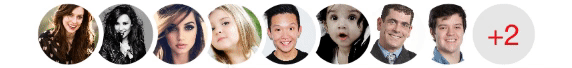
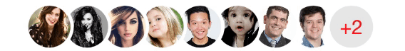
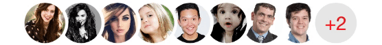
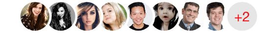
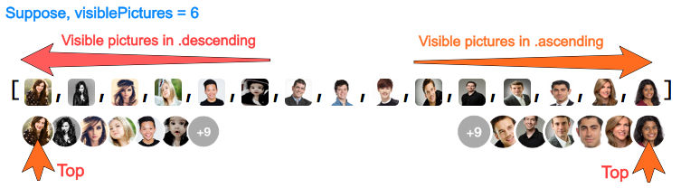
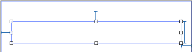
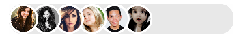
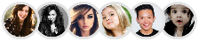
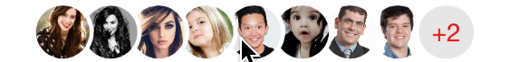
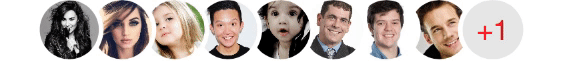

<p align="center">
  
</p>

<br />
<br />

<p align="center">
   
  &nbsp;&nbsp;&nbsp;&nbsp;&nbsp;&nbsp;&nbsp;&nbsp;&nbsp;&nbsp;&nbsp;&nbsp;
   
  &nbsp;&nbsp;&nbsp;&nbsp;&nbsp;&nbsp;&nbsp;&nbsp;&nbsp;&nbsp;&nbsp;&nbsp;
  
</p>

<p align="center">
   
  &nbsp;&nbsp;&nbsp;&nbsp;&nbsp;&nbsp;&nbsp;&nbsp;&nbsp;&nbsp;&nbsp;&nbsp;
   
  &nbsp;&nbsp;&nbsp;&nbsp;&nbsp;&nbsp;&nbsp;&nbsp;&nbsp;&nbsp;&nbsp;&nbsp;
  
</p>

<p align="center">
   
  &nbsp;&nbsp;&nbsp;&nbsp;&nbsp;&nbsp;&nbsp;&nbsp;&nbsp;&nbsp;&nbsp;&nbsp;
   
  &nbsp;&nbsp;&nbsp;&nbsp;&nbsp;&nbsp;&nbsp;&nbsp;&nbsp;&nbsp;&nbsp;&nbsp;
  
</p>

<p align="center">
   
  &nbsp;&nbsp;&nbsp;&nbsp;&nbsp;&nbsp;&nbsp;&nbsp;&nbsp;&nbsp;&nbsp;&nbsp;
   
  &nbsp;&nbsp;&nbsp;&nbsp;&nbsp;&nbsp;&nbsp;&nbsp;&nbsp;&nbsp;&nbsp;&nbsp;
  
</p>

<p align="center">
   
  &nbsp;&nbsp;&nbsp;&nbsp;&nbsp;&nbsp;&nbsp;&nbsp;&nbsp;&nbsp;&nbsp;&nbsp;
   
  &nbsp;&nbsp;&nbsp;&nbsp;&nbsp;&nbsp;&nbsp;&nbsp;&nbsp;&nbsp;&nbsp;&nbsp;
  
</p>

<br />
<br />

<p align="center">
    <a href="https://twitter.com/Kiranjasvanee">
        
    </a>
    <a href="https://github.com/KiranJasvanee/OnlyPictures/blob/master/LICENSE">
        
    </a>
    <a href="https://cocoapods.org/pods/OnlyPictures">
        
    </a>
    <a href="http://cocoapods.org/pods/OnlyPictures/">
        
    </a>
    <a href="https://github.com/KiranJasvanee/OnlyPictures/issues">
        
    </a>
    <a href="https://github.com/KiranJasvanee/OnlyPictures">
        
    </a>
    <a href="https://github.com/KiranJasvanee/OnlyPictures">
        
    </a>
    <a href="https://github.com/KiranJasvanee/OnlyPictures">
        
    </a>
</p>

----------------

### Installation

OnlyPictures is available through [CocoaPods](http://cocoapods.org). To install
it, simply add the following line to your Podfile:

```ruby
pod 'OnlyPictures'
```
### Explaination & Live tracker.
<p align="center">
  
</p>
<p align="center">
  
</p>
<p align="center">
  
```swift
onlyPictures.order = .descending
```
</p>


### Usage

Add `UIView` in your outlet, select it and go to `Properties -> Identity Inspector`,  add `OnlyHorizontalPictures` in `class property`. `OnlyVerticalPictures` about to release soon.

 &nbsp;&nbsp;&nbsp;&nbsp; `->` &nbsp;&nbsp;&nbsp;&nbsp;  

Create `instance` of this outlet as below.
```swift
@IBOutlet weak var onlyPictures: OnlyHorizontalPictures!
```

Use `DataSource` for data assignment & `Delegate` to get indication of action performed in pictures.
```swift
onlyPictures.dataSource = self
onlyPictures.delegate = self
```

#### DataSource Methods

```swift
extension ViewController: OnlyPicturesDataSource {

    // ---------------------------------------------------
    // returns the total no of pictures
    
    func numberOfPictures() -> Int {
        return pictures.count
    }
    
    // ---------------------------------------------------
    // returns the no of pictures should be visible in screen. 
    // In above preview, Left & Right formats are example of visible pictures, if you want pictures to be shown without count, remove this function, it's optional.
    
    func visiblePictures() -> Int {
        return 6
    }
    
    
    // ---------------------------------------------------
    // return the images you want to show. If you have URL's for images, use next function instead of this.
    // use .defaultPicture property to set placeholder image. This only work with local images. for URL's images we provided imageView instance, it's your responsibility to assign placeholder image in it. Check next function.
    // onlyPictures.defaultPicture = #imageLiteral(resourceName: "defaultProfilePicture")
    
    func pictureViews(index: Int) -> UIImage {
        return pictures[index]
    }
    
    
    // ---------------------------------------------------
    // If you do have URLs of images. Use below function to have UIImageView instance and index insted of 'pictureViews(index: Int) -> UIImage'
    // NOTE: It's your resposibility to assign any placeholder image till download & assignment completes.
    // I've used AlamofireImage here for image async downloading, assigning & caching, Use any library to allocate your image from url to imageView.
    
    func pictureViews(_ imageView: UIImageView, index: Int) { 
    
        // Use 'index' to receive specific url from your collection. It's similar to indexPath.row in UITableView.
        let url = URL(string: self.pictures[index])
        
        imageView.image = #imageLiteral(resourceName: "defaultProfilePicture")   // placeholder image
        imageView.af_setImage(withURL: url!)   
    }
}
```
#### Delegate Methods
```swift
extension ViewController: OnlyPicturesDelegate {
    
    // ---------------------------------------------------
    // receive an action of selected picture tap index
    
    func pictureView(_ imageView: UIImageView, didSelectAt index: Int) {
        
    }
    
    // ---------------------------------------------------
    // receive an action of tap upon count
    
    func pictureViewCountDidSelect() {
        
    }
    
    // ---------------------------------------------------
    // receive a count, incase you want to do additionally things with it.
    // even if your requirement is to hide count and handle it externally with below fuction, you can hide it using property `isVisibleCount = true`.
    
    func pictureViewCount(value: Int) {
        print("count value: \(value)")
    }
    
    
    // ---------------------------------------------------
    // receive an action, whem tap occures anywhere in OnlyPicture view.
    
    func pictureViewDidSelect() {
        
    }
}
```

#### Reload

##### `.reloadData()`
- `reloadData()` will work similar to `UITableView -> reloadData()`, it will call `numberOfPictures()` & `pictureViews(index: Int)`/`pictureViews(_ imageView: UIImageView, index: Int)` again to reform pictures. 

#### Properties

##### .order

- Pictures works based on `LIFO` - Last In First Out, means last added will be shown at top (recent). 
- If your array contains pictures in `ascending`, it will show last picture OR in other words last appended picture at top (recent). 
- If your array contains pictures in `descending`, set `.order property` to `.descending` to show first picture at top (recent). 

&nbsp;&nbsp;&nbsp;&nbsp;&nbsp;&nbsp;&nbsp;&nbsp;&nbsp;&nbsp;&nbsp;  `.ascending` &nbsp;&nbsp;&nbsp;&nbsp;&nbsp;&nbsp;&nbsp;&nbsp;&nbsp;&nbsp;&nbsp;&nbsp;&nbsp;&nbsp;&nbsp;&nbsp;&nbsp;&nbsp;&nbsp;&nbsp;&nbsp;&nbsp;&nbsp;&nbsp;&nbsp;&nbsp;&nbsp;&nbsp;&nbsp;&nbsp;&nbsp;&nbsp;&nbsp;&nbsp;&nbsp;&nbsp;&nbsp;&nbsp;&nbsp;&nbsp;&nbsp;&nbsp;    `.descending`

&nbsp;&nbsp;&nbsp;  &nbsp;&nbsp;&nbsp;&nbsp;&nbsp;&nbsp;&nbsp;&nbsp;&nbsp;&nbsp;&nbsp;&nbsp;&nbsp;&nbsp;&nbsp;&nbsp;&nbsp;&nbsp;&nbsp;&nbsp;&nbsp;   

```swift
onlyPictures.order = .descending
```

##### .recentAt
&nbsp;&nbsp;&nbsp;&nbsp;&nbsp;&nbsp;&nbsp;&nbsp;&nbsp;&nbsp;&nbsp;&nbsp;&nbsp;&nbsp;&nbsp;&nbsp;  `.left` &nbsp;&nbsp;&nbsp;&nbsp;&nbsp;&nbsp;&nbsp;&nbsp;&nbsp;&nbsp;&nbsp;&nbsp;&nbsp;&nbsp;&nbsp;&nbsp;&nbsp;&nbsp;&nbsp;&nbsp;&nbsp;&nbsp;&nbsp;&nbsp;&nbsp;&nbsp;&nbsp;&nbsp;&nbsp;&nbsp;&nbsp;&nbsp;&nbsp;&nbsp;&nbsp;&nbsp;&nbsp;&nbsp;&nbsp;&nbsp;&nbsp;&nbsp;&nbsp;&nbsp;&nbsp;&nbsp;&nbsp;&nbsp;&nbsp;&nbsp;    `.right`

&nbsp;&nbsp;&nbsp;  &nbsp;&nbsp;&nbsp;&nbsp;&nbsp;&nbsp;&nbsp;&nbsp;&nbsp;&nbsp;&nbsp;&nbsp;&nbsp;&nbsp;&nbsp;&nbsp;&nbsp;&nbsp;&nbsp;&nbsp;&nbsp;   

```swift
onlyPictures.recentAt = .left
```


##### .alignment
&nbsp;&nbsp;&nbsp;&nbsp;&nbsp;&nbsp;&nbsp;&nbsp;&nbsp;&nbsp;&nbsp;&nbsp;&nbsp;&nbsp;&nbsp;&nbsp;&nbsp;&nbsp;   `.left` &nbsp;&nbsp;&nbsp;&nbsp;&nbsp;&nbsp;&nbsp;&nbsp;&nbsp;&nbsp;&nbsp;&nbsp;&nbsp;&nbsp;&nbsp;&nbsp;&nbsp;&nbsp;&nbsp;&nbsp;&nbsp;&nbsp;&nbsp;&nbsp;&nbsp;&nbsp;&nbsp;&nbsp;&nbsp;&nbsp;&nbsp;&nbsp;&nbsp;&nbsp;&nbsp;&nbsp;&nbsp;&nbsp;&nbsp;&nbsp;&nbsp;&nbsp;&nbsp;&nbsp;&nbsp;&nbsp;&nbsp;&nbsp;&nbsp;&nbsp;&nbsp;&nbsp;&nbsp;&nbsp;&nbsp;&nbsp;&nbsp;&nbsp;&nbsp;    `.center`    &nbsp;&nbsp;&nbsp;&nbsp;&nbsp;&nbsp;&nbsp;&nbsp;&nbsp;&nbsp;&nbsp;&nbsp;&nbsp;&nbsp;&nbsp;&nbsp;&nbsp;&nbsp;&nbsp;&nbsp;&nbsp;&nbsp;&nbsp;&nbsp;&nbsp;&nbsp;&nbsp;&nbsp;&nbsp;&nbsp;&nbsp;&nbsp;&nbsp;&nbsp;&nbsp;&nbsp;&nbsp;&nbsp;&nbsp;&nbsp;&nbsp;&nbsp;&nbsp;&nbsp;&nbsp;&nbsp;&nbsp;&nbsp;&nbsp;&nbsp;&nbsp;&nbsp;    `.right`

 &nbsp;  &nbsp; 

```swift
onlyPictures.alignment = .left
```


##### .countPosition
&nbsp;&nbsp;&nbsp;&nbsp;&nbsp;&nbsp;&nbsp;&nbsp;&nbsp;&nbsp;&nbsp;&nbsp;&nbsp;&nbsp;&nbsp;&nbsp;&nbsp;&nbsp;  `.right` &nbsp;&nbsp;&nbsp;&nbsp;&nbsp;&nbsp;&nbsp;&nbsp;&nbsp;&nbsp;&nbsp;&nbsp;&nbsp;&nbsp;&nbsp;&nbsp;&nbsp;&nbsp;&nbsp;&nbsp;&nbsp;&nbsp;&nbsp;&nbsp;&nbsp;&nbsp;&nbsp;&nbsp;&nbsp;&nbsp;&nbsp;&nbsp;&nbsp;&nbsp;&nbsp;&nbsp;&nbsp;&nbsp;&nbsp;&nbsp;&nbsp;&nbsp;&nbsp;&nbsp;&nbsp;&nbsp;   `.left`

&nbsp;&nbsp;&nbsp;  &nbsp;&nbsp;&nbsp;&nbsp;&nbsp;&nbsp;&nbsp;&nbsp;&nbsp;&nbsp;&nbsp;&nbsp;&nbsp;&nbsp;&nbsp;&nbsp;&nbsp;&nbsp;&nbsp;&nbsp;&nbsp;   

```swift
onlyPictures.countPosition = .right
```


##### .gap
&nbsp;&nbsp;&nbsp;&nbsp;&nbsp;&nbsp;&nbsp;&nbsp;&nbsp;&nbsp;&nbsp;`.gap = 20` &nbsp;&nbsp;&nbsp;&nbsp;&nbsp;&nbsp;&nbsp;&nbsp;&nbsp;&nbsp;&nbsp;&nbsp;&nbsp;&nbsp;&nbsp;&nbsp;&nbsp;&nbsp;&nbsp;&nbsp;&nbsp;&nbsp;&nbsp;&nbsp;&nbsp;&nbsp;&nbsp;&nbsp;&nbsp;&nbsp;&nbsp;&nbsp;&nbsp;&nbsp;&nbsp;&nbsp;    `.gap = 36`     &nbsp;&nbsp;&nbsp;&nbsp;&nbsp;&nbsp;&nbsp;&nbsp;&nbsp;&nbsp;&nbsp;&nbsp;&nbsp;&nbsp;&nbsp;&nbsp;&nbsp;&nbsp;&nbsp;&nbsp;&nbsp;&nbsp;&nbsp;&nbsp;&nbsp;&nbsp;&nbsp;&nbsp;&nbsp;&nbsp;&nbsp;&nbsp;&nbsp;&nbsp;&nbsp;&nbsp;&nbsp;&nbsp;&nbsp;&nbsp;&nbsp;&nbsp;&nbsp;&nbsp;&nbsp;&nbsp;    `.gap = 50` 

&nbsp;&nbsp;&nbsp;&nbsp;  &nbsp;&nbsp;&nbsp;&nbsp;&nbsp;&nbsp;&nbsp;&nbsp;&nbsp;&nbsp;&nbsp;&nbsp;&nbsp;&nbsp;&nbsp;&nbsp;&nbsp;&nbsp;&nbsp;&nbsp;&nbsp;&nbsp;&nbsp;  &nbsp;&nbsp;&nbsp;&nbsp;&nbsp;&nbsp;&nbsp;&nbsp;&nbsp;&nbsp;&nbsp;&nbsp;&nbsp;&nbsp;&nbsp;&nbsp;&nbsp;&nbsp;&nbsp;&nbsp;&nbsp;&nbsp;&nbsp; 

```swift
onlyPictures.gap = 36
```

##### .spacing
&nbsp;&nbsp;&nbsp;    `.spacing = 0` &nbsp;&nbsp;&nbsp;&nbsp;&nbsp;&nbsp;&nbsp;&nbsp;&nbsp;&nbsp;&nbsp;&nbsp;&nbsp;&nbsp;&nbsp;&nbsp;&nbsp;&nbsp;     `.spacing = 2`     &nbsp;&nbsp;&nbsp;&nbsp;&nbsp;&nbsp;&nbsp;&nbsp;&nbsp;&nbsp;&nbsp;&nbsp;&nbsp;&nbsp;&nbsp;&nbsp;&nbsp;&nbsp;   `.spacing = 4` &nbsp;&nbsp;&nbsp;&nbsp;&nbsp;&nbsp;&nbsp;&nbsp;&nbsp;&nbsp;&nbsp;&nbsp;&nbsp;&nbsp;&nbsp;&nbsp;&nbsp;&nbsp;&nbsp;&nbsp;&nbsp;&nbsp;&nbsp;&nbsp;&nbsp;   `.spacing = 4` 

 &nbsp;&nbsp;  &nbsp;&nbsp;  &nbsp;&nbsp; 

```swift
onlyPictures.spacing = 2
```

##### .spacingColor
&nbsp; `.spacingColor = .gray` &nbsp;&nbsp;&nbsp;&nbsp;&nbsp;&nbsp;&nbsp;&nbsp;&nbsp;&nbsp;&nbsp;&nbsp;&nbsp;&nbsp;&nbsp;&nbsp;&nbsp;&nbsp;&nbsp;&nbsp;&nbsp; `.spacingColor = .white`

 &nbsp;&nbsp;&nbsp;&nbsp;&nbsp;&nbsp;&nbsp;&nbsp;&nbsp;&nbsp; 

```swift
onlyPictures.spacingColor = UIColor.white
```

##### .imageInPlaceOfCount

- Set image in place of count. If this property set, count properties won't effect.

 &nbsp;&nbsp;&nbsp;&nbsp;&nbsp;&nbsp;&nbsp;&nbsp;&nbsp;&nbsp; 

```swift
onlyPictures.imageInPlaceOfCount = UIImage(named:"image_name")
```

#### Properties for count

##### .backgroundColorForCount

 

```swift
onlyPictures.backgroundColorForCount = .orange
```

##### .textColorForCount

 

```swift
onlyPictures.textColorForCount = .red
```

##### .fontForCount

 

```swift
onlyPictures.fontForCount = UIFont(name: "HelveticaNeue", size: 18)!
```

##### .isHiddenVisibleCount
- To hide count, set `.isHiddenVisibleCount = true`. But you can receive count in a following funtion of `OnlyPicturesDelegate` - `pictureViewCount(value: Int)`. 
```swift
onlyPictures.isHiddenVisibleCount = true
```

#### *Things you can do additionally, Insert & Remove at First/Last/Specific-Position*
- NOTE: it's your responsibility to insert/remove image in your collection too, you used for pictures. It's similar pattern you follows using UITableView.

##### Insert first in `.order = .descending`

 &nbsp;&nbsp;&nbsp;&nbsp;&nbsp;&nbsp;&nbsp;&nbsp;&nbsp;&nbsp;&nbsp;&nbsp;&nbsp;&nbsp;&nbsp;&nbsp;&nbsp;&nbsp;&nbsp;&nbsp;  
```swift
onlyPictures.insertFirst(image: UIImage(named: "p11"), withAnimation: .popup)
```

##### Insert last in `.order = .descending`
 &nbsp;&nbsp;&nbsp;&nbsp;&nbsp;&nbsp;&nbsp;&nbsp;&nbsp;&nbsp;&nbsp;&nbsp;&nbsp;&nbsp;&nbsp;&nbsp;&nbsp;&nbsp;&nbsp;&nbsp;  
```swift
onlyPictures.insertLast(image: UIImage(named: "p12"), withAnimation: .popup)
```

##### Insert at specific position in `.order = .descending`, below added at 2nd position
 &nbsp;&nbsp;&nbsp;&nbsp;&nbsp;&nbsp;&nbsp;&nbsp;&nbsp;&nbsp;&nbsp;&nbsp;&nbsp;&nbsp;&nbsp;&nbsp;&nbsp;&nbsp;&nbsp;&nbsp;  
```swift
onlyPictures.insertPicture(UIImage(named: "p12"), atIndex: 2, withAnimation: .popup)
```

##### Remove first in `.order = .descending`
 &nbsp;&nbsp;&nbsp;&nbsp;&nbsp;&nbsp;&nbsp;&nbsp;&nbsp;&nbsp;&nbsp;&nbsp;&nbsp;&nbsp;&nbsp;&nbsp;&nbsp;&nbsp;&nbsp;&nbsp;  
```swift
onlyPictures.removeFirst(withAnimation: .popdown)
```

##### Remove last in `.order = .descending`
 &nbsp;&nbsp;&nbsp;&nbsp;&nbsp;&nbsp;&nbsp;&nbsp;&nbsp;&nbsp;&nbsp;&nbsp;&nbsp;&nbsp;&nbsp;&nbsp;&nbsp;&nbsp;&nbsp;&nbsp;  
```swift
onlyPictures.removeLast(withAnimation: .popdown)
```


##### Remove from specific position in `.order = .descending`, below removed from 2nd position
 &nbsp;&nbsp;&nbsp;&nbsp;&nbsp;&nbsp;&nbsp;&nbsp;&nbsp;&nbsp;&nbsp;&nbsp;&nbsp;&nbsp;&nbsp;&nbsp;&nbsp;&nbsp;&nbsp;&nbsp;  
```swift
onlyPictures.removePicture(atIndex: 2, withAnimation: .popdown)
```

##### *Let's check how insertion works with dynamic images. remove is same as above.*
##### Insert first in `.order = .descending`


```swift
let url = URL(string: "http://insightstobehavior.com/wp-content/uploads/2017/08/testi-5.jpg")
onlyPictures.insertFirst(withAnimation: .popup) { (imageView) in
        imageView.image = #imageLiteral(resourceName: "defaultProfilePicture")
        imageView.af_setImage(withURL: url!)
}
```

##### Insert last in `.order = .descending`


```swift
let url = URL(string: "http://insightstobehavior.com/wp-content/uploads/2017/08/testi-5.jpg")
onlyPictures.insertLast(withAnimation: .popup) { (imageView) in
        imageView.image = #imageLiteral(resourceName: "defaultProfilePicture")
        imageView.af_setImage(withURL: url!)
}
```

##### Insert at specific position in `.order = .descending`, below added at 2nd position


```swift
let url = URL(string: "http://insightstobehavior.com/wp-content/uploads/2017/08/testi-5.jpg")
onlyPictures.insertPicture(atIndex: 2, withAnimation: .popup) { (imageView) in
        imageView.image = #imageLiteral(resourceName: "defaultProfilePicture")
        imageView.af_setImage(withURL: url!)
}
```

### Author

Kiran Jasvanee,

Skype - kiranjasvanee

LinkedIn - https://www.linkedin.com/in/kiran-jasvanee-ab363778

eMail -  kiran.jasvanee@gmail.com

### License

OnlyPictures is available under the MIT license. See the LICENSE file for more info.
