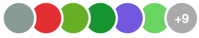
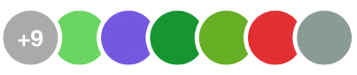

<p align="center">
   
  &nbsp;&nbsp;&nbsp;&nbsp;&nbsp;&nbsp;&nbsp;&nbsp;&nbsp;&nbsp;&nbsp;&nbsp;
   
  &nbsp;&nbsp;&nbsp;&nbsp;&nbsp;&nbsp;&nbsp;&nbsp;&nbsp;&nbsp;&nbsp;&nbsp;
  
</p>

<p align="center">
   
  &nbsp;&nbsp;&nbsp;&nbsp;&nbsp;&nbsp;&nbsp;&nbsp;&nbsp;&nbsp;&nbsp;&nbsp;
   
  &nbsp;&nbsp;&nbsp;&nbsp;&nbsp;&nbsp;&nbsp;&nbsp;&nbsp;&nbsp;&nbsp;&nbsp;
  
</p>


<p align="center">
    <a href="https://twitter.com/Kiranjasvanee">
        
    </a>
    <a href="https://github.com/KiranJasvanee/OnlyPictures/blob/master/LICENSE">
        
    </a>
    <a href="https://cocoapods.org/pods/OnlyPictures">
        
    </a>
    <a href="http://cocoapods.org/pods/OnlyPictures/">
        
    </a>
    <a href="https://github.com/KiranJasvanee/OnlyPictures/issues">
        
    </a>
    <a href="https://github.com/KiranJasvanee/OnlyPictures">
        
    </a>
    <a href="https://github.com/KiranJasvanee/OnlyPictures">
        
    </a>
    <a href="https://github.com/KiranJasvanee/OnlyPictures">
        
    </a>
</p>

----------------

### Installation

OnlyPictures is available through [CocoaPods](http://cocoapods.org). To install
it, simply add the following line to your Podfile:

```ruby
pod 'OnlyPictures'
```

### Usage
Use `DataSource` for data assignment & `Delegate` to get indication of action performed in pictures.

#### DataSource 

```
extension ViewController: OnlyPicturesDataSource {

    // returns the total no of pictures
    func numberOfPictures() -> Int {
        return pictures.count
    }
    
    // returns the no of pictures should be visible in screen. 
    // In above preview, Left & Right formats are example of visible pictures, if you want pictures to be shown without count, remove this function, it's optional.
    func visiblePictures() -> Int {
        return 6
    }
    
    // return the images you want to show.
    func pictureViews(index: Int) -> UIImage {
        return pictures[index]
    }
}
```

### Author

Kiran Jasvanee, kiran.jasvanee@gmail.com

### License

OnlyPictures is available under the MIT license. See the LICENSE file for more info.
